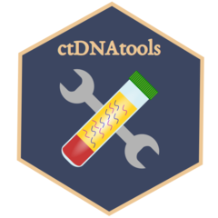
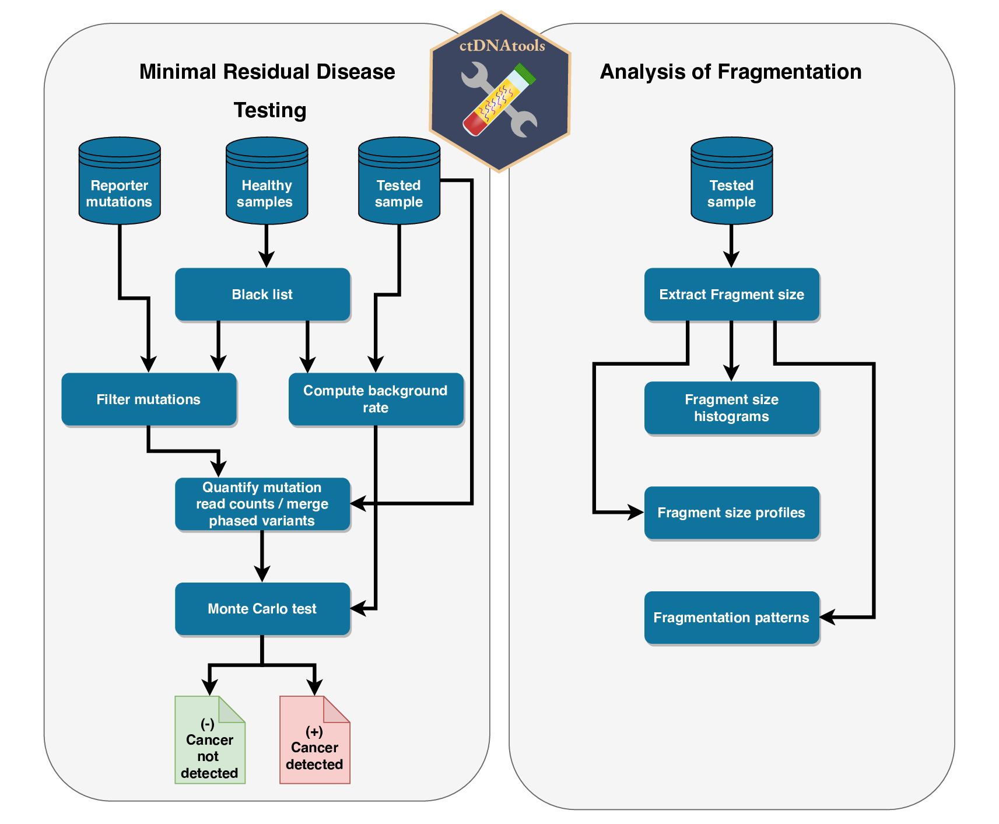

# ctDNAtools <a href='https:/alkodsi.github.io/ctDNAtools'></a>

<!-- badges: start -->
[](https://travis-ci.com/alkodsi/ctDNAtools)
[](https://codecov.io/gh/alkodsi/ctDNAtools?branch=master)
[](https://doi.org/10.1101/2020.01.27.912790)
[](https://www.tidyverse.org/lifecycle/#stable)
<!-- badges: end -->

The ctDNAtools package provides functionalities to analyze circulating tumor DNA (ctDNA)/ cell-free DNA (cfDNA) sequencing data.
The tools cover analysis of ctDNA/cfDNA fragmentation and analysis of cancer minimal residual disease.

## Package overview

<a href='https:/alkodsi.github.io/ctDNAtools'></a>

## Installation


``` r
# From github

# install.packages("devtools")
devtools::install_github("alkodsi/ctDNAtools")
```

## Getting started

Browse the vignette [here](https://alkodsi.github.io/ctDNAtools/articles/ctDNAtools.html)

## Citation

Alkodsi A, Meriranta L, Pasanen A, Leppä S (2020). “ctDNAtools: An R package to
work with sequencing data of circulating tumor DNA.” _bioRxiv_.
